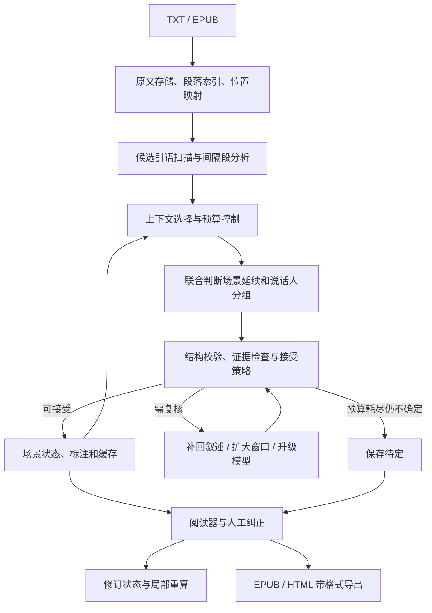

# 轻小说对话辅助阅读器：完整实施计划

项目目录：`F:\Code\novel-dialogue-reader`  
计划日期：2026-09-27  
状态：方案设计；尚未实现或验证模型效果。  
暂定名称：Novel Dialogue Reader。首个可用版本为本地前后端应用，包含 TXT/EPUB 导入、模型接入设置、效果预览、待定对白确认，以及 EPUB/HTML 带格式导出。

## 1. 目标与已确认原则

为中文轻小说译本的对白添加颜色、侧边标记或可选人物编号，降低读者辨认说话人的负担。

优先解决两件事：

1. **保持对话完整**：心理、环境、回忆和动作描写可能穿插在对话中，不能仅因出现叙述或超过固定长度就判定对话结束；同时减少无关叙述进入 LLM 的数量。
2. **区分场景内人物**：通过语义判断对白来自当前场景的哪个已有说话人，或来自新说话人。支持“人未到、话先到”；识别全书真实姓名不是首要目标。

设计原则：

- 对话场景边界、模型调用边界、阅读页面边界分别管理。
- 同一场景可以跨多次调用，沿用人物状态。
- 区分“已有说话人”“确实出现新人”“无法确定”，禁止将不确定全部解释为新人。
- 原文不可变；识别结果单独保存，程序负责渲染。
- 不确定时保留原样；用户纠正优先于自动推断。
- 使用场景内匿名编号，不要求先建立全书人物知识库。
- 本文中的窗口、阈值、工期和指标均为待验证配置、估计或目标，不是已有性能承诺。

## 2. 范围与交付边界

### 2.1 MVP

- 导入单本 TXT 或 EPUB；TXT 允许选择编码，EPUB 解析目录、正文顺序与基本排版；均保留章节、段落和原文位置。
- 提取常见引号中的候选对白，处理叙述穿插、场景延续和新人加入。
- 使用场景内 S1、S2、S3 编号；区分对白、心声、引用和待定类型。
- LLM 批量识别，支持局部扩展上下文与有限次数复核。
- 提供本地浏览器阅读页、API 接入配置页、真实效果预览页与集中待确认界面，支持颜色/编号开关、人工纠正与缓存。
- 记录实际 token 用量、处理进度；支持按章处理和断点续跑。
- 支持将整本书或选定章节导出为 EPUB 3 和离线单文件 HTML，保留有效人物样式、人工确认、章节与本地插图；导出不调用 LLM。

### 2.2 后续扩展

EPUB 复杂样式高保真渲染、HTML/Markdown 导入等格式扩展；更可靠的长叙述筛选；无引号对白、聊天记录等特殊格式；本地小模型；可选的跨场景人物关联。

### 2.3 不作为第一版交付条件

全书真实身份识别、人物关系图、剧情总结、语音生成、OCR、多用户协作、小说抓取、模型微调、云端部署。日文原文作为独立语言方向评估，不能沿用中文译本的效果结论。

## 3. 任务定义

| 概念 | 定义 | 重要边界 |
| --- | --- | --- |
| 候选引语 Quote | 程序提取的可能对白片段 | 引号内容也可能是心声、引用或强调 |
| 发言 Utterance | 一个角色的一段发言，可包含多个句子 | 不按句号把连续发言拆给不同人物；被叙述打断的片段可关联 |
| 间隔段 Gap | 相邻候选引语之间的叙述 | 可能维持、改变或结束当前交谈 |
| 对话场景 Scene | 交谈关系连续的一组发言及相关叙述 | 地点变化、新人加入不自动结束场景 |
| 处理窗口 Window | 单次模型调用的输入范围 | 由 token 预算约束，不等于场景 |
| 说话人分组 Speaker Group | 场景内被判断为同一人的对白集合 | 编号只在所属场景中有意义 |
| 候选参与者 Participant | 被叙述提及或参与活动的实体 | 不一定已经说话 |
| 待定 Unknown | 证据不足，无法可靠分组 | 不把所有待定对白归成一个虚构人物 |

展示编号按首次可靠发言顺序生成。内部稳定 ID 与展示编号分离，支持合并、拆分和撤销。场景切换后可重新编号，界面明确其局部含义。

## 4. 总体架构



全文可以进行便宜的本地扫描，不因此将全文发送给 LLM。需要处理的对白与需要提供的证据分别计算，每次模型输入都能回溯到原文。

## 5. 文本解析与候选对白提取

### 5.1 原文和位置

- 保存原始文件与内容哈希，解析结果绑定原文版本。
- 建立规范化文本到原文的映射。统一换行或清理排版时同步维护映射，不能用变更后的偏移去修改原文。
- TXT 内部位置采用规范化文本的 Unicode 码点偏移，区间为 `[start, end)`。
- 前端 UTF-16 字符串索引与码点偏移显式转换，包含 emoji、扩展汉字的样例必须验证。
- 段落、候选引语、间隔段分别有稳定 ID；重复对白不能仅按文本搜索定位。EPUB 另保存 spine 文档和文本节点到规范化文本的双向映射，接口详情见第 12 节。

### 5.2 提取策略

- 用成对符号扫描与栈处理 `“”`、`「」`、`『』` 和必要的半角双引号，支持嵌套与跨段。
- 未闭合引号、异常嵌套进入解析异常列表，不能吞掉后续整个章节。
- 标题、空行和分隔符提供边界线索，不自动证明交谈结束。
- 首版主要覆盖有引号的直接对白；范围外格式单独统计，避免混淆系统能力。
- 引号中的标题、强调、回忆引语先标为候选类型，不直接产生当前场景说话人。
- 嵌套转述默认将外层对白归给当前发言者；内层引用不自动为被引用的人建立现场人物。
- 同一人说出的多句连续对白作为一段发言处理，必要时允许多个 quote 片段关联一个 utterance。

输出：段落索引、候选引语、间隔段、章节线索、解析异常与原文位置映射。

## 6. 场景划分与对话完整性

### 6.1 暂定边界

先围绕引语构造候选区域，再联合判断场景是否延续与谁在发言。不要提前用长度阈值不可逆地分割场景。

相邻引语之间的 Gap 状态：

- `CONTINUE`：维持当前交谈，如等待回答、对上一句反应。
- `UPDATE`：交谈持续但参与状态变化，如加入、离开、隔门发言。
- `BREAK`：交谈结束或转入另一独立交谈情境。
- `UNCERTAIN`：证据不足，暂缓确认。

模型可以修订候选边界，但需要返回证据位置。场景 ID、边界版本和修订历史由程序管理；一次调用内可以识别多个场景。

### 6.2 判断线索

| 倾向延续 | 倾向更新 | 倾向切换 |
| --- | --- | --- |
| 等待回答、接着问、仍看着对方 | 新人进门、某人离开、远处喊话 | 明确交谈结束后的时间跳跃 |
| 心理活动围绕上一句展开 | 电话接通、第三人插话 | 转入独立新事件和交谈对象 |
| 回忆结束后回答原先的问题 | 移动中继续交谈 | 叙述视角和事件框架共同改变 |

以上是特征而非关键词硬规则。短叙述可能切换场景，长叙述也可能维持同一次交谈。多人对话中的短暂支线不必立即重置整个场景。

### 6.3 长场景分批

达到调用预算时：

1. 在完整段落或引语边界停止，不截断发言。
2. 保存场景 ID、人物分组、可靠关联、最近发言与未解决问题。
3. 下一窗口携带少量重叠；同一引语只保存一份有效标注。
4. 重叠区冲突触发局部复核，不静默覆盖用户确认。
5. 沉默不是离场。长时间未发言的角色保留在场景记录中。
6. 人物太多时可减少当前提示中的低相关候选，但保留检索入口和“其他已有角色”选项，避免误判为新人。

### 6.4 关键用例

```text
「你真的决定了吗？」
我没有立刻回答。窗外的雨令我想起去年夏天。……
她把杯子放下，仍然在等我的回答。
「嗯，明天就走。」
```

预期：同一场景，回忆和环境描写不切断交谈。

```text
「明天见。」
三天后，我独自来到车站。
「请出示车票。」
```

预期：间隔很短也可切换场景，不能按物理距离强行关联。

## 7. 非对白筛选与上下文预算

### 7.1 保留层级

1. 完整保留待识别对白。
2. 优先保留说话归属、动作主体、代词指向、进出场、视角和时空变化等线索原句。
3. MVP 完整保留较短 Gap，建立效果基线。
4. 长 Gap 先保留两端和检测到的相关片段，再通过实验引入细筛选。
5. 省略处保留位置及省略标记，不把不相邻的句子伪装成紧邻句子。
6. 原文始终可取回；补回省略叙述是优先复核动作。

禁止默认采用“只看前后两句”“无姓名就删除”“心理描写都无关”等规则。心理描写可能说明谁在回答、谁听到了哪句话。

### 7.2 实现顺序

- MVP：规则定位与保守保留，不为了压缩而先调用一次完整 LLM。
- 优化版：评估本地相关性分类器或小模型，只有效果和总成本确有收益时启用。
- 若使用付费模型摘要，摘要输入、输出和后续识别均计入成本。优先保留原句片段，避免摘要丢失关系或引入事实。
- 规则解决了某句对白，也可能仍需将它作为其他对白的上下文；规则覆盖比例不等于 token 节省比例。
- 合并相邻待处理问题的上下文，避免重复发送同一间隔段。

### 7.3 初始实验配置

| 参数 | 起点 | 说明 |
| --- | --- | --- |
| 每次正文 | 1,500～3,000 token | 另计提示、状态、输出预留 |
| 窗口重叠 | 100～300 token | 按完整语义单元调整，统计重复量 |
| 场景状态 | 目标数百 token | 按需检索，不无限累积摘要 |
| 复核窗口 | 逐步扩展至约 4,000～8,000 token | 受每章预算和模型上下文约束 |
| 难例语义复核 | 默认最多 2 轮 | 先补证据，再按需升级模型 |

参数均需调优。用目标 tokenizer 或接口 usage 记录用量，不把汉字数等同于 token 数。超长单条引语单独处理并保持发言标识；预算不足时返回待定，不强截文本后猜测。

## 8. 场景内匿名说话人识别

### 8.1 三种决策

- `EXISTING`：关联当前场景的已有分组。
- `NEW`：有证据表明与已有分组不同，创建新说话人。
- `UNKNOWN`：无法可靠区分已有角色或新人，不创建分组。

新人物不需要姓名，可记录“门外的声音”等有依据的临时描述。位置、语气与动作是证据，不能成为永久身份键。

### 8.2 证据与候选

- 优先使用明确归属、动作衔接、指代、问答关系和叙述视角。
- 口头禅与说话风格仅辅助，不能单独证明身份。
- “我”绑定当前叙述视角，不假设全书所有“我”相同。
- 未发言的人可先作为候选参与者，首次发言时再关联说话人。
- 被对白提及的名字可能是受话人或第三方，不能直接当作说话人。
- 同一人可以连续说话；两人轮流只是弱提示。
- 集体发言标为 `GROUP` 或待定，不能强塞给某一人。
- 裁剪候选列表时保留“其他已有角色”和检索能力，防止名单遗漏导致误建新人。

### 8.3 先有声音、后有人物

```text
「里面有人吗？」
门外传来一个陌生的声音。
……
门被推开，刚才喊话的少年走了进来。
```

先建立匿名说话人，再将“少年”关联到这个分组。“不能匹配已有角色”本身不是 `NEW` 的充分证据，缺少证据时使用 `UNKNOWN`。

### 8.4 延迟修订

- 支持提出合并、拆分、撤销分组修订，保存证据和版本。
- 低可靠判断置于暂定层，不变成下一窗口中的确定事实。
- 用户确认与自动结果分别保存，自动重算不能覆盖用户确认。
- 待定结果不参与确定身份的传播。
- 状态以短描述和证据位置组织，不反复重写人物长简介。

### 8.5 阅读进度

场景内匿名处理优先，跨场景真实身份合并后置。仍需记录后文证据的揭示位置：

- 每个自动合并记录 `evidence_position` 和 `visible_from`。
- 初读时不在相关证据出现前展示后文才成立的关系；颜色本身也可能泄露身份。
- 严格按进度模式只使用已经可见的文本；整章预处理的结果也遵守展示时点。
- 后置“某某说”可在所属段落可见后确认。
- 重读模式可以显式允许后文修订前文颜色。

## 9. 模型接口与校验

### 9.1 输入

固定任务说明、带 ID 的原文片段、目标引语 ID、场景状态、候选说话人及边界。正文作为数据与指令分隔。

要求：只处理给定 ID，不修改原文，区分对白和心声，允许待定，不凭作品外知识补身份，证据只引用输入中的位置。

### 9.2 输出协议示意

```json
{
  "gap_decisions": [["g17", "CONTINUE"], ["g18", "UPDATE"]],
  "new_speakers": [{"temp_id": "n1", "anchor": "q19", "evidence": ["p32"]}],
  "labels": [
    {"quote_id": "q17", "kind": "speech", "speaker_ref": "s1"},
    {"quote_id": "q18", "kind": "speech", "speaker_ref": null},
    {"quote_id": "q19", "kind": "speech", "speaker_ref": "n1"}
  ],
  "identity_updates": [],
  "needs_context": ["q18"]
}
```

实现时定义版本化 JSON Schema；场景切换使用局部场景引用及边界 ID，新增人物 ID 由程序验证后分配，避免跨场景冲突。示例仅展示一个场景，不是全部字段。

普通结果输出紧凑标签，复核时按需输出短证据，不要求逐句长解释。紧凑数组与对象结构的取舍以解析可靠性和实际 token 为依据。

### 9.3 校验与接受

- 验证引语、证据和说话人 ID 存在且在合法范围。
- 所有目标引语必须有结果；额外 ID、重复冲突和非法枚举视为协议错误。
- 禁止模型写原文偏移、改原文或覆盖用户锁定结果。
- 检查引用证据是否存在；证据存在不等于判断正确，仍需效果评估。
- 格式修复重试与语义复核分开统计并设上限。
- 依据证据类别、冲突和验证集校准设置接受策略；模型自报概率不能作为唯一依据。
- 本文不承诺由程序校验消除语义错误。

## 10. 状态、数据结构与缓存

### 10.1 最小持久化对象

| 对象 | 主要字段 | 用途 |
| --- | --- | --- |
| Book | ID、文件哈希、格式、编码、文本版本、章节与资源清单 | 绑定 TXT/EPUB 原文 |
| Paragraph / Quote / Gap | ID、位置、所属章节、候选类型 | 定位与检索 |
| Scene | ID、范围、状态、边界版本、证据 | 管理交谈连续性 |
| SpeakerGroup | ID、场景 ID、首个发言、临时描述、证据、版本 | 匿名人物分组 |
| Participant | 场景 ID、提及位置、关联分组（可空） | 管理尚未发言的参与者 |
| Annotation | 引语 ID、类型、分组（可空）、来源、状态、版本 | 着色依据 |
| Correction | 目标、旧值、新值、用户确认、时间 | 可撤销纠正 |
| InferenceRun | 模型、提示版本、输入哈希、状态依赖、usage、延迟 | 成本、复现与缓存 |
| Job | 书籍、任务类型、处理范围、配置引用、幂等键、检查点、状态 | 导入/预览/识别/重算/导出与断点续跑 |
| ExportSnapshot | 书籍版本、范围、标注与身份投影、样式、可见证据策略、快照哈希 | 导出时冻结一致结果 |
| ExportArtifact | 快照 ID、格式、导出器版本、文件哈希/大小、状态、校验报告 | 生成、查询与下载新文件 |

新增对象：`ModelProfile` 保存协议、地址、模型与非敏感参数及凭据引用；`ReviewItem` 保存目标、原因、候选、上下文引用、处理状态和版本。密钥本体不放入普通数据库字段。

队列状态采用 `PENDING / DEFERRED / RESOLVED`，与 Annotation 状态独立；跳过待定项只改变队列状态。没有 ReviewItem 的普通对白也可由阅读页发起人工更正。
对白 ID、说话人 ID 和场景 ID 分别独立；显示颜色绑定场景内稳定分组 ID，不绑定姓名字符串。

### 10.2 状态分层

- 场景状态：`OPEN`、`PENDING_BOUNDARY`、`CLOSED`。
- 标注状态：`PROVISIONAL`、`ACCEPTED`、`USER_CONFIRMED`、`UNKNOWN`。
- 进出场事件记录证据位置；没有离场证据不自动移除参与者。
- 闪回和引用保留原交谈的可恢复状态，不用一个全局“当前人物列表”覆盖所有叙述层。
- MVP 对复杂叙述层嵌套先保留待定；不为支持任意嵌套而扩大首版范围。

### 10.3 缓存与重算

缓存键至少包含：原文版本、实际输入片段与目标引语、模型标识及配置、提示与 schema 版本、上下文筛选版本、被依赖的人物状态版本、阅读模式。

- 换颜色、字号、显示编号不导致重新识别。
- 修改原文使相关定位和标注失效，不能复用旧偏移。
- 人工更正某个对白或人物关联时，标记受影响的后续窗口为待更新。
- 标记依赖失效后，依据用户显式操作或事先开启且有预算上限的自动更新设置启动重算；沿依赖更新到状态稳定或可靠场景结束。无法证明独立时采取保守失效，不静默使用旧结果。
- 只因与当前窗口无关的角色资料变动，不应让整本书缓存全部失效。
- 写入有效标注与更新检查点使用事务；中途退出不留下半个窗口的已完成状态。
- 同一开放场景按顺序提交，避免并发分配人物产生冲突。只有确认独立的场景才并行处理。

## 11. 前端页面、用户流程与交互规格

首个可用版本必须覆盖导入、API 配置、真实效果预览、待定对白确认、正式阅读、带格式导出与任务状态，不能只提供命令行算法或静态阅读样例。

### 11.1 页面与组件

| 页面 / 路由 | 主要组件 | 必须支持的操作 |
| --- | --- | --- |
| 书架与导入 `/library` | 文件选择/拖放、书籍卡片、导入进度、解析警告 | 导入 TXT/EPUB，打开已有书籍，恢复阅读 |
| 模型设置 `/settings/models` | 配置表单、测试结果、主模型/复核模型选择 | 输入接口地址、API Key 和模型名，测试、保存、编辑 |
| 效果预览 `/books/:id/preview` | 章节/范围选择、预算、原文/标注切换、人物图例 | 选小范围真实试运行，比较效果，调整显示，进入正式处理 |
| 阅读 `/books/:id/read` | 目录、正文、场景提示、图例、对白详情抽屉 | 分章节阅读、跳转、切换标注、查看或纠正任意对白 |
| 待确认 `/books/:id/review` | 待定列表、上下文、候选人物、确认表单 | 按场景处理待定、冲突、用户标记问题，跳过或确认 |
| 导出（阅读/预览页内对话框） | 格式、章节、样式、未处理统计、局部样张、任务与下载 | 导出 EPUB/HTML，查看兼容性与校验结果 |
| 任务面板（书籍页内） | 进度、状态、usage、失败提示 | 暂停、继续、局部重试、查看预算余量 |

阅读页抽屉与待确认页复用同一套对白详情和确认组件，避免不同入口产生不同的纠正规则。桌面可左右并排，小屏改为切换/抽屉布局，正文不能被侧栏挤到不可读。

### 11.2 完整用户流程

导入 TXT/EPUB → 本地解析与章节预览 → 配置并测试模型接口 → 选择一段对话试标注 → 查看真实着色效果和待定项 → 确认处理范围与预算 → 按章处理并阅读 → 在阅读页或待确认页纠正 → 按需重算受影响部分 → 选择格式与范围 → 预览样式 → 下载带格式文件。

原文预览、章节浏览、颜色切换、手动确认及带格式导出不需要调用模型。效果试运行、正式处理、模型复核必须由明确操作触发，并显示对应预算或用量。

### 11.3 文件导入与解析预览

首版支持 `.txt` 和 `.epub`，以文件内容校验格式，不仅检查扩展名。两种格式均走同一套对白识别与纠正流程。

- TXT：优先 UTF-8；自动识别结果可由用户切换为 GB18030 等编码，确认后再建立位置索引。
- EPUB：读取元数据、目录与 spine 阅读顺序，保留段落、插图、基本注音和文本节点映射；不得把压缩包中文件名排序当作阅读顺序。
- 上传后先展示书名、格式、章节数、部分原文和解析警告，不直接向 LLM 发送整本书。
- 书籍内容哈希用于发现重复导入，复用已有书籍与标注前检查版本一致性。
- 解析失败显示具体章节或文件原因；对损坏、无法解析的输入不给出“导入成功”。
- TXT 没有目录时根据可靠标题模式建立候选章节，无法识别则按段落范围阅读。
- EPUB 首版目标是结构正确的重排阅读；复杂原书样式的完全复刻不作为首版阻塞条件。
- HTML/Markdown 导入可在后续增加；PDF、MOBI、AZW3 暂不宣称原生导入支持，界面提示可先转换成 TXT/EPUB。HTML 导出已纳入首版，见第 11.8 节。

### 11.4 LLM 接入配置页

表单字段：配置名称、协议类型、Base URL、API Key、模型标识、是否用作主模型或复核模型。高级选项包括超时、输出上限与已验证支持的生成参数；提供方不支持的参数不默认发送。

首版接入一种明确实现并实测的协议，例如 `chat-completions-compatible`；其他协议由适配器扩展。不把“可填写任意地址”宣传为兼容所有模型服务。

- 模型名支持手动输入；模型列表自动拉取是可选能力，不能成为配置成功的前提。
- 支持自定义地址和本地推理服务；无鉴权服务允许 API Key 为空。
- Base URL 的填法给出明确示例，后端统一拼接端点，避免重复版本路径。
- “测试连接”由后端发起小请求，验证鉴权、模型可用性和预期结构化输出；展示耗时、协议问题和实际 usage。测试可能消耗少量 token，按钮旁明确说明。
- 密钥用密码输入框，仅在提交时发送给本地后端；提交成功后清空前端明文，不进入 localStorage、URL、日志或状态持久化。
- 默认仅在后端当前会话保存密钥；用户选择记住时使用操作系统凭据库，SQLite 只保存引用。凭据库不可用时退回会话模式，不明文降级落盘。
- 读取配置只返回非敏感字段和 `has_key`，不回传已保存的 Key。编辑时区分不修改、替换和删除密钥。
- 未配置密钥或服务不可用时仍能导入和阅读原文；仅禁用需要推理的操作，并提供设置入口。

### 11.5 效果预览页

这里是实际识别结果预览，不能用硬编码颜色或演示数据代替真实模型输出。

1. 用户选择书籍、章节以及一段对话或原文范围；默认小范围，不自动处理全书。
2. 展示试运行范围与预算。算法可以为该范围补充必要上下文，但不得超出预算或阅读模式许可。
3. 显示待处理、调用中、部分完成、成功、失败或预算耗尽状态。
4. 使用同一阅读组件展示原文/标注切换；桌面可并排比较并按同一对白定位，小屏使用单视图切换。
5. 展示场景内 S1/S2 图例、已标注与待定数量、实际 token 和耗时；模型自报信心不展示为实测准确率。
6. 允许调整颜色、色条/文字着色、编号显示、字号和行距；这些只改变渲染，不重新调用模型。
7. 待定对白可直接打开确认抽屉，或跳转到待确认页。
8. 满意后选择按章或指定范围继续处理。试运行与正式任务共用引擎、缓存和标注存储，不能将已完成内容重复收费处理。

修改模型或算法参数后保留先前结果的版本；重新试运行是显式操作，不因选择框变化自动调用。预览对比不同版本时，已确认人工结果始终有清楚的优先级。

### 11.6 不确定对白的确认界面

入口包括阅读页的待定标记、效果预览页和独立待确认列表。

列表支持按章节、场景和原因筛选：说话人未知、多个候选冲突、场景边界待定、对白类型不清、用户主动标记。列表显示引语片段、所在位置、原因和处理状态。

详情至少包含：

- 目标对白及前后叙述，可展开完整场景内的允许上下文；不能只给孤立一句话。
- 已有说话人编号、临时描述、最近可靠对白与证据位置。
- 模型候选及简短依据（若有）；没有依据时明确显示暂无可靠候选，不编造百分比。
- 当前选择、是否人工锁定、版本、对后续标注可能产生的影响。

可执行操作：

| 操作 | 行为 | 是否调用 LLM |
| --- | --- | --- |
| 选择已有说话人并确认 | 当前发言关联已有分组并锁定 | 否 |
| 确认为新说话人 | 创建分组，可选填写局部称呼，并锁定当前发言 | 否 |
| 改为心声、引用或集体发言 | 更新类型及关联 | 否 |
| 仍不确定 / 暂时跳过 | 保持未确定，仅更新队列处理状态 | 否 |
| 展开更多原文 | 获取允许范围内的原文与已有标注 | 否 |
| 补充上下文后重试 | 按预算触发局部模型复核 | 是 |
| 合并/拆分人物分组 | 明确展示影响范围，作为独立可撤销操作 | 否，除非另行启动重算 |
| 撤销最近更正 | 恢复上一版本并更新依赖状态 | 否 |

确认默认只作用于当前发言；“应用到整组”必须单独选取，不静默批量改色。确认后可自动跳到下一条，暂时跳过不算已确认，也不虚增识别覆盖率。

人工确认立即改变显示并标记后续依赖过期；如果需要新的付费推理，展示重算范围和预算，由用户显式启动或使用事先开启且有上限的自动更新设置。手动点选本身不会隐式发起付费调用。

### 11.7 正式阅读与任务反馈

- 相同场景内同一分组稳定着色；场景切换有轻量提示，编号配合颜色避免仅靠色觉区分。
- 心声使用独立样式，待定默认保留原样，可显示问号；多个待定项不能被当作同一个角色。
- 即使还没配置模型、模型请求失败或任务预算耗尽，也能阅读原文和已完成标注。
- 后台进度通过轻量轮询获取；只查询活动任务，断线重连从检查点恢复。
- 暂停表示停止调度新窗口，当前已经提交的请求可能继续计费并完成保存，界面显示“暂停中”。
- 显示待处理/处理中/暂停中/已暂停/部分完成/完成/失败/预算耗尽，避免把全部情况写成一个失败提示。
- 无 Key、鉴权失败、模型不存在、限流、超时、格式输出错误和解析错误分别给出可操作提示，不泄露请求凭据。

### 11.8 EPUB 与 HTML 带格式导出

**首版格式**：EPUB 3 为电子书阅读的主要交付格式；HTML 为可离线打开的单文件补充格式。TXT 不保留颜色；PDF、MOBI、AZW3 暂不作为首版导出要求。

**导出入口与选项**：阅读页、效果预览页提供“导出”按钮。选择整本书或章节、EPUB/HTML、颜色与人物编号样式、初读/重读策略；显示有效标注、待定、过期和未处理对白数量，以及导出文件所用的标注快照。

- 默认使用“颜色＋可见人物编号”，另提供仅颜色和仅编号；编号按场景作用域区分，不要求真实姓名。
- 默认导出当前范围的完整正文；待定、PROVISIONAL、过期或未处理对白保留原样，不强行配色、不静默删除。
- 可选只导出已完成章节，但必须明确列出哪些章节未包含，不能将部分处理伪装成完整标注。
- 使用 ACCEPTED 和 USER_CONFIRMED 的有效结果；人工锁定优先。人工确认的心声采用对应样式，锁定未知仍保持未确定。
- 默认以初读安全策略导出：按每段原文位置使用当时可成立的身份投影。静态电子书无法随阅读进度动态解锁，不在书首或场景首预先列出尚未出现的人物身份。用户可选择重读版统一使用后文确认结果。
- 导出保存不可变快照，生成期间发生的新纠正不混入同一文件；页面提示快照时间并允许刷新重导。
- 预览和正式生成使用同一后端导出样式/投影逻辑，切换样式或重新下载不调用 LLM。

**内容与格式**：

- TXT 输入按已解析章节创建新电子书；EPUB 输入保留章节顺序、标题、可用封面、插图、基本注音、脚注和链接关系，采用结构正确的重排排版。
- 在原文对应文本节点附加样式与可选编号，不将正文转成图片；原始文件不被覆盖。
- EPUB 内嵌 XHTML、CSS 和本地资源；HTML 内嵌 CSS 和可支持的图片资源，不依赖本地后端、API Key、远程字体或 JavaScript 才能显示标注。
- EPUB 复杂原书样式的完全复刻仍属后续扩展；资源缺失或不支持时给出具体报告，不静默丢失正文或插图。
- 导出是独立静态阅读文件，应用中的点击确认、模型复核等操作保留在原项目中。文件下载后可在其他阅读器打开，但其显示设置可能覆盖颜色，因此编号必须是真实可见文字。

**校验与验收**：校验章节完整性、原文正文一致性、资源与链接、样式及人物归属；EPUB 增加 EPUBCheck，保留工具版本和报告。工具缺失标为“尚未完成标准校验”，不能伪造通过。正式发布须通过标准检查，并至少在两款独立 EPUB 阅读器试读；HTML 验证离线打开。检查报错不能下载为“校验通过”的成品。

导出器生成新文件并通过下载接口交付；同一快照、选项和导出器版本可复用结果。文件名区分原书与标注版，部分范围明确标为节选。不同阅读器允许用户覆盖作者样式，因此不能承诺所有设备呈现完全相同的颜色。[EPUB 阅读系统规范](https://www.w3.org/TR/epub-rs-33/)

## 12. 前后端实现方案与接口契约

### 12.1 默认技术方案

- 前端：React + TypeScript + Vite；独立组件实现导入、模型设置、原文渲染、人物图例、确认抽屉、待确认列表与任务面板。
- 后端：Python + FastAPI + 数据 schema 校验；处理文件、场景、推理、状态、纠正和预算。
- 存储：SQLite 保存元数据和标注，本地文件目录保存原文与解析资源；凭据不作为普通配置明文存储。
- 任务执行：首版使用单个本地持久化任务调度器，SQLite 记录状态；恢复运行依赖检查点，不只依赖进程内队列。
- 模型适配层统一协议、usage、超时、结构化输出与重试；首版一个主模型、一个可选复核模型。
- EPUB 首版接入统一解析与标注层；通过 spine 文档路径、文本节点路径、节点内偏移和内容校验映射到原文。保留 ruby 等节点结构，正文识别文本与注音文本不重复拼接。

实施时锁定依赖版本，核验实际模型接口和计费；上述技术作为实施默认选择，不表示已经生成或运行这些模块。

### 12.2 计划目录结构

```text
novel-dialogue-reader/
  PLAN.md
  README.md
  backend/
    ingest/           # TXT/EPUB、编码、章节、位置映射
    exports/          # 标注快照、XHTML/HTML、CSS、打包与格式校验
    quotes/           # 引语、类型与嵌套
    scenes/           # Gap 与场景状态
    context/          # 上下文、重叠、预算
    speakers/         # 匿名分组与修订
    llm/              # 协议适配、模型配置、提示与复核
    jobs/             # 持久化任务、检查点、调度
    storage/          # SQLite、文件、缓存、凭据引用
    api/              # 文件、配置、任务、标注、确认、usage
  frontend/
    pages/            # 书架、设置、预览、阅读、待确认
    components/       # 原文渲染、图例、确认抽屉、任务面板
    api/              # 类型化请求与统一错误处理
    state/            # 非敏感 UI 状态与查询缓存
  evaluation/         # 标注规范、评估脚本、报告
  tests/              # 解析、状态、接口、页面与端到端回归
  data/               # 本地原文、资源和人工标注
  configs/            # 不含密钥的配置与实验参数
```

### 12.3 前后端职责

前端负责输入、选择、展示与人工确认；后端负责权威状态、格式解析、位置映射、LLM 请求、预算校验和结果存储。浏览器不直接把小说和 Key 发给模型服务，所有模型请求经过本地后端。

EPUB 资源在导入时校验范围和解压大小，渲染时屏蔽脚本及主动网络内容，资源通过书籍内受控路径读取。原文件不被更改；渲染安全处理与识别文本映射分别记录。

### 12.4 API 契约草案

业务 API 统一前缀 `/api`，成功响应返回资源与版本，错误响应包含 `code`、可读 `message`、可选 `details` 和 `request_id`，不包含密钥。以下是实施契约，尚未存在可调用端点。

| 方法与路径 | 核心输入 | 输出 / 责任 |
| --- | --- | --- |
| `POST /api/books/import` | multipart 文件、可选编码 | 书籍 ID、解析任务 ID；不调用 LLM |
| `GET /api/books` | 分页 | 书籍与阅读/处理状态 |
| `GET /api/books/{id}` | 书籍 ID | 元数据、格式、解析状态与警告 |
| `GET /api/books/{id}/chapters` | 书籍 ID | 目录与稳定章节 ID |
| `GET /api/books/{id}/content` | 章节/范围、阅读进度 | 原文节点、稳定定位与资源引用 |
| `GET /api/books/{id}/resources/{resource_id}` | 已登记资源 ID | 书内图片等资源，不接受任意磁盘路径 |
| `GET /api/model-profiles` | 无 | 非敏感配置、协议和 has_key |
| `POST /api/model-profiles` | 地址、模型、协议、可选 Key、保存策略 | 配置 ID，Key 不回传 |
| `PATCH /api/model-profiles/{id}` | 变更字段、密钥操作、版本 | 更新配置；区分保留、替换与清除 Key |
| `DELETE /api/model-profiles/{id}` | 配置 ID | 删除配置及凭据引用；运行中依赖给出冲突 |
| `POST /api/model-profiles/test` | 配置 ID 或未保存的测试配置 | 小请求结果、兼容性、耗时及 usage |
| `POST /api/books/{id}/estimates` | 范围、模型、上下文参数 | 本地估算与假设；没有实测基础时明确不确定性 |
| `POST /api/jobs` | 书籍、范围、profile_id、mode、预算、幂等键 | `mode=preview/process/recompute`，返回任务 ID |
| `GET /api/jobs/{id}` | 任务 ID | 状态、已完成范围、用量、待定数与错误 |
| `POST /api/jobs/{id}/pause` | 任务 ID | 停止新增调用；返回暂停中或已暂停 |
| `POST /api/jobs/{id}/resume` | 任务 ID、适用预算 | 从检查点继续，不重复处理完成窗口 |
| `GET /api/books/{id}/annotations` | 范围、版本、阅读模式 | 有效标注、场景图例和证据展示时点 |
| `GET /api/books/{id}/review-items` | 章节、场景、原因、状态、分页 | 待确认队列及计数 |
| `GET /api/review-items/{id}` | 阅读进度、上下文范围 | 对白、原文上下文、候选及关联版本 |
| `POST /api/quotes/{id}/corrections` | action、speaker_ref、scope、expected_version | 应用确认并返回 correction_id、影响范围；不调用 LLM |
| `POST /api/review-items/{id}/defer` | 当前版本 | 暂时跳过，保留未确定标注 |
| `POST /api/corrections/{id}/undo` | expected_version | 恢复上一版，返回受影响依赖 |
| `POST /api/scenes/{id}/speaker-revisions` | merge/split、分组与 quote IDs、版本 | 显式修订，返回可撤销记录 |
| `POST /api/quotes/{id}/recheck` | 补充范围、模型配置、预算、版本 | 新建有限的局部复核任务 |
| `GET /api/books/{id}/usage` | 时间/任务范围 | 按模型、阶段和任务汇总实际 token 与费用估算 |
| `POST /api/books/{id}/exports/preview` | 范围、样式、初读/重读策略 | 冻结快照、统计与局部导出样张；不调用 LLM |
| `POST /api/books/{id}/exports` | snapshot_id、格式、样式、幂等键 | 创建 EXPORT 任务，返回 export_id、job_id |
| `GET /api/exports/{id}` | 导出 ID | 进度、快照、格式、文件信息和校验报告 |
| `GET /api/exports/{id}/download` | 已完成导出 ID | 下载 EPUB/HTML；服务端解析受控文件路径 |

导入和长耗时处理均返回任务标识，页面使用任务接口获取进度。导入、导出与 LLM 任务明确区分；导出仅做本地生成，不调用模型；任务创建和模型测试的费用口径也区分记录。

### 12.5 接口一致性与恢复

- 所有改标注/分组操作包含 `expected_version`；版本冲突返回 409，并要求页面刷新后重新选择，不能静默覆盖。
- 任务创建使用幂等键，双击提交和网络重发不创建重复付费任务。
- 后端使用持久化检查点与单场景提交锁；多个浏览器页面不能重复分配人物或覆盖人工锁定结果。
- 确认后返回受影响引语/窗口和缓存版本，前端同步刷新阅读页、图例、待确认列表与计数。
- 标注状态与队列处理状态分离；暂时跳过不等于确认，UNKNOWN 不能因退出列表就变成 ACCEPTED。
- 估算缺少 tokenizer、价格或试运行数据时显示估算依据与缺项，不用未经证实的精确金额。
- 日志记录 request_id、模型、usage 与错误类别；密钥脱敏，正文仅在用户主动开启特定诊断时保留。

## 13. 数据集与人工标注规范

### 13.1 数据准备

- 初步验证：从 3～5 部不同作品抽取约 300～500 段对白及其完整上下文。
- 正式验收：扩充到至少约 1,000～2,000 段对白，分布于多个完整场景；实际规模由误差稳定性决定。
- 优先纳入用户真实遇到的难例，不只抽取明确写着“某某说”的句子。
- 提供少量自行编写的最小样例测试格式与边界，不能用这些样例替代真实作品的效果评估。

### 13.2 覆盖类别

双人省略姓名、多轮问答、三人以上插话、同一人连续发言、长心理描写、环境描写、回忆后恢复对话、短文本切换场景、视角变化、声音先出现、新人中途加入、离场后返回、长时间沉默、同义称呼、嵌套引用、集体发言和本来就无法判断的文本。

每类单独统计样本数与结果。遇到某类数据很少时，不能用总体平均代替其结论。

### 13.3 人工标签

- 对白范围与类型。
- 金标准场景范围，允许标记边界不确定区间。
- 场景内匿名人物分组；不要求真实姓名。
- 同一发言被叙述分隔时的片段关系。
- 身份证据位置及其可用于展示的时点。
- 无法确定时记录候选集合或 `UNRESOLVABLE`，不强行创造确定答案。
- Gap 中必须保留的证据片段，用于检查上下文筛选是否删错。

人工标注先保留原始判断，再记录争议处理。对关键难例尽量复查，条件允许时采用第二人独立标注。

### 13.4 数据划分

调参、校准和最终测试尽量按整部作品分开，不随机打散同一本书的相邻对白。若作品数量不足，明确标注只是初步实验，不能声称跨作品泛化。

同一场景、重叠窗口、同一作品的近似版本不得跨训练和测试集泄漏。最终测试集冻结后不用于调整提示词或阈值；后续迭代使用新版本测试集并记录变化。

## 14. 效果、成本与体验验收

### 14.1 必须报告的指标

| 指标 | 定义或用途 |
| --- | --- |
| 对白提取精确率/召回率 | 是否漏掉对白或把标题、引用误当对白；同时评估边界匹配 |
| 场景错误切断率 | 金标准连续交谈中，被系统错误重置身份的比例 |
| 场景错误连接率 | 金标准不同交谈被错误连接的比例 |
| 分组准确率 | 对预测和金标准匿名编号做最优匹配后计算，不能逐字比较 S1/S2 |
| 同人关系的 Precision/Recall/F1 | 同一人被拆开、不同人被合并的程度 |
| 已接受标注准确率 | 正式显示的可判定对白中，人物分组正确的比例 |
| 覆盖率 | 正式标注对白数 / 范围内金标准对白总数；漏提取也降低覆盖率 |
| 无证据强标率 | 金标准不可判定对白中，被系统强行确定人物的比例 |
| 新人物误建/漏建 | 不确定变新人、确有新人却并入旧人的问题 |
| 难例指标 | 未显式写说话人的对白单独计算准确率和覆盖率 |
| 成本与延迟 | 每万字实际输入/输出/推理 token、实付费用、复核率、耗时 |
| 阅读体验 | 每百段对白手动纠正次数、明显误导次数与实际阅读反馈 |

匿名编号整体互换不算错。评估分组时在金标准场景范围内统一匹配，不能按系统自己切出的碎场景重新匹配，否则会掩盖错误切断。待定对白不纳入“已接受准确率”的分子分母，但必须计入覆盖率；不能通过全部拒答获得好成绩。

### 14.2 首轮产品目标

以下用于决定是否进入可用版本，不代表预计一定达到：

- 冻结测试集上，已接受标注准确率目标不低于 97%。
- 总体覆盖率目标不低于 70%，并单列没有显式归属语句的难例结果。
- 关键难例不能只依赖明确归属对白撑高总体指标；若用户最关心的类别大多待定，应继续优化而非宣布完成。
- TXT 与 EPUB 均通过导入、目录/范围定位、原文预览、真实识别和确认结果保存的闭环验收。
- 用户无需修改源码即可填写 API 配置并测试；密钥不回传、不写入前端持久存储与普通日志。
- 效果预览和正式阅读使用相同标注引擎；待定确认页能完成已有角色、新人、待定和类型更正。
- 原文不被改写，显示位置正确，已处理内容重读不产生新调用。
- TXT/EPUB 均能导出有效 EPUB 和离线 HTML；保留选定范围全文与有效标注，未确定部分原样保留，导出流程的 LLM 调用数为零。
- 任务中断可继续，用户更正不被自动覆盖，预算达到上限能够停止并保留结果。
- 报告分作品结果、样本数与不确定性；目标接近阈值或样本过少时扩大验证。

场景边界允许一定标注歧义。重点检查它是否导致人物串位或丢失必要上下文，而不只追求某个精确段落编号。

### 14.3 对比实验

| 实验 | 配置 | 回答的问题 |
| --- | --- | --- |
| B0 | 仅明确归属规则 | 无 LLM 的最低成本基线 |
| B1 | 固定窗口、完整上下文、LLM 批量标签 | 通用批处理能做到什么程度 |
| B2 | B1 加持续场景状态与边界判断 | 场景连续性是否改善人物一致性 |
| B3 | B2 加保守叙述筛选 | 节省多少输入，丢失多少有效证据 |
| B4 | B3 加局部复核与模型升级 | 困难对白的额外收益是否值得成本 |

固定测试集与预算口径。逐句长上下文方法可在小样本上作为成本参照，不必花钱对整本书运行明显重复的方案。

建议消融项：去掉场景状态、去掉叙述、取消待定类别、限制候选人物数、不同窗口与重叠大小。每次改变一个关键因素，记录 prompt、模型和配置版本。

## 15. token 与费用核算

### 15.1 记录口径

所有调用都计入，包括人物状态提取、Gap 分类、摘要、格式重试和语义复核。

```text
总输入 = 首轮正文 + 重叠正文 + 每次提示与人物状态 + 所有额外调用输入
总输出 = 首轮标签 + 额外调用输出
总费用 = 各提供方实际计费项目之和
```

如果推理 token 已包含在提供方的输出计费中，不重复相加；若单独计费则单列。供应商前缀缓存可能降低输入单价，不等同于应用结果缓存，也不保证减少逻辑输入长度。最终以接口 usage 和账单口径核验。

### 15.2 量级示例（假设，非实测）

假设正文为目标分词器下的 100,000 token，共 2,000 段对白：

| 项目 | 假设计算 | token |
| --- | --- | ---: |
| 首轮输入 | 50 块 ×（2,000 正文 + 400 提示、状态和重叠） | 120,000 |
| 首轮输出 | 2,000 段 × 平均 10 token 紧凑标签 | 20,000 |
| 局部复核 | 5 次 ×（4,000 输入 + 400 输出） | 22,000 |
| 合计 | 未额外假设计费推理量 | 162,000 |

实际 schema 带证据、状态更新或新人物较多时，输出可能明显高于每段 10 token，需用真实调用替换示例。若逐句调用且每句附带 1,500 token 上下文，仅输入为 3,000,000 token；这只说明共享上下文的价值，不是项目节省比例承诺。

### 15.3 预算控制

- 配置每次输入上限、输出上限、每章总 token 上限、语义复核上限与可选金额上限。
- 第一次使用某模型时，先小样本记录实际用量，再给整章估算范围。
- 达到预算时保存结果并停用额外推断，未解决项保留待定；不静默超支。
- 限流、超时使用有上限的退避；失败重试也记录消耗，避免重复提交已完成窗口。
- 模型路由优先“缺什么证据就补什么”，再考虑更强模型，而不是每条对白都让两个模型投票。

## 16. 开发里程碑与任务依赖

按熟悉 Python 和网页开发的个人开发者估计，包含 TXT/EPUB 和完整交互的首个可用版本约 4～6 周；时间受样本整理、EPUB 复杂度与实际效果影响。可先用 TXT 验证算法，但首版交付必须同时满足两种输入格式、原有四项前端功能及带格式导出的验收；导出另预留约 2～4 个工作日，正式兼容性验证按实际问题调整。

### P0：数据与实验契约（约 1～2 天）

- [ ] 整理用户真实阅读难例与不同作品样本。
- [ ] 写明对白类型、场景边界、匿名人物和不可判定情况的标注规范。
- [ ] 建立初始 300～500 段标注及作品级划分。
- [ ] 选择一个主模型和一个候选复核模型，确认实际接口与计费。
- [ ] 定义基线、评估脚本输入和费用记录格式。

退出条件：有可检查的金标准、冻结的小型验证集合与统一口径；尚未依赖精美阅读 UI。

### P1：双格式解析与基础识别（约 3～5 天）

- [ ] TXT 编码与 EPUB 目录/spine/基本排版解析，统一位置映射、引号扫描和 Gap 建立。
- [ ] 原文不可变存储和 quote ID。
- [ ] 单模型批量标签、严格 schema、有限重试。
- [ ] 跑通 B0、B1；记录错误类别和实际 usage。

退出条件：TXT 与 EPUB 均能导入、读取目录和完整处理一个样例章节，标注可回溯原文；用含注音和插图的 EPUB 验证映射，格式错误不破坏原文。

### P2：场景状态与匿名分组（约 3～5 天）

- [ ] Gap 四分类和可修订场景边界。
- [ ] EXISTING / NEW / UNKNOWN 三类决策。
- [ ] 窗口衔接、人物状态、声音先出现、重叠冲突处理。
- [ ] 暂定结果与确认结果分离；支持分组修订数据结构。
- [ ] 跑通 B2，优先修复错误切断与错误合并。

退出条件：关键难例具有可解释的成功或待定结果；长场景跨窗口不会无依据重置全部人物。

### P3：完整前后端交互（约 5～8 天）

- [ ] 书架与 TXT/EPUB 导入、解析状态、章节和原文预览。
- [ ] API 配置表单、协议适配、测试连接、会话密钥和可选系统凭据保存。
- [ ] 真实效果试运行、原文/标注对比、图例、样式调整和实际用量。
- [ ] 阅读页、待定抽屉与集中确认队列，支持已有/新人/待定/心声等操作。
- [ ] 人工确认锁定、撤销、跨页面同步和版本冲突处理。
- [ ] 预览与正式处理共用缓存，任务幂等、持久化检查点、暂停继续和按章预处理。
- [ ] 预算上限、模型失败和不支持格式的反馈；没有 API 也能阅读原文。
- [ ] 对 TXT 与 EPUB 分别完成一次导入、配置、小范围预览、确认、继续阅读的端到端试用。

退出条件：四项核心界面均可操作并连接真实后端；预览不是静态样例；确认会保存并更新阅读页；重读、换色与手动确认不会触发新的付费调用。

### P3.1：带格式导出（约 2～4 天）

- [ ] 标注快照、有效结果筛选和按原文位置的初读投影。
- [ ] TXT/EPUB 输入统一生成 EPUB 3 和离线单文件 HTML。
- [ ] EPUB 元数据、目录、XHTML、CSS、资源打包及 HTML 资源内嵌。
- [ ] 导出对话框、范围与样式选择、样张、进度、校验信息和下载。
- [ ] 验证原文一致、目录/图片/注音/脚注可用、人工修订生效且导出不调用模型。
- [ ] EPUBCheck、两款独立 EPUB 阅读器试读及 HTML 离线打开验证。

退出条件：用户可下载可阅读的带格式文件；未处理部分、格式降级和校验状态均明确。对应 DEVELOPMENT.md 的 T15A、T15B，安排在全流程正式验收之前。

### P4：成本优化与正式验收（约 2～4 天）

- [ ] 长 Gap 的保守筛选和原文补回。
- [ ] 难例局部复核、可选模型升级与依赖重算。
- [ ] 完成 B3、B4，扩充冻结测试集。
- [ ] 出具分作品、分难例、覆盖率、准确率、成本和阅读体验报告。
- [ ] 根据结果选择默认窗口和接受策略，保留可回滚基线。

退出条件：达到验收目标，或明确列出未达标类别及下一项实验；不能只因功能齐全宣称效果达标。

### P5：格式扩展、EPUB 高保真与模型优化（后续独立估时）

- [ ] 在首版 EPUB 结构化阅读基础上完善复杂样式、多种排版和更高保真展示。
- [ ] 按需要增加 HTML/Markdown 导入，继续复用位置映射和标注接口，回归验证已有格式。
- [ ] 根据实际调用量判断是否需要本地模型。
- [ ] 有足够人工确认数据后，再比较候选打分模型、轻量分类器或微调。

训练目标优先是“上下文与候选人物的关联评分”，而不是跨所有小说固定姓名分类。LLM 生成标签只能作为候选监督，未经检查不得直接当作金标准；测试集始终独立。

## 17. 验证清单与失败处理

### 17.1 必须覆盖的回归用例

- [ ] 心理描写插在问答之间，场景不被错误切断。
- [ ] 短暂时间跳跃开始新的交谈，旧人物不强行继承。
- [ ] 同一人连续三段发言，不强制交替。
- [ ] 第三人插话和人未到话先到，正确创建或保留待定。
- [ ] 叙述里出现名字但未发言，不凭名字数量创建颜色。
- [ ] 单次预算耗尽，下一窗口仍沿用场景内人物。
- [ ] 跨窗口冲突可定位并局部复核。
- [ ] 不可判断的对白不会产生一串虚构人物。
- [ ] 嵌套引用、心声和集体发言不污染普通分组。
- [ ] 重复文本、特殊 Unicode 字符、跨段引号位置正确。
- [ ] 原文变更、提示变更、人物更正正确触发缓存失效。
- [ ] 中断恢复不重复提交已完成窗口，不覆盖人工确认。
- [ ] 达到预算或调用失败仍可阅读原文，未完成部分有明确状态。
- [ ] 后文合并人物不会在初读模式提前改变前文身份展示。

### 17.2 主要风险与对应措施

| 问题 | 可观测信号 | 处理 |
| --- | --- | --- |
| 过早切断场景 | 同一人跨窗口不断变色 | 保留暂定边界、持续状态、增加必要重叠 |
| 场景连接过长 | 旧角色被套用到新交谈 | 复核时空和事件切换证据 |
| 叙述筛选删掉线索 | B3 显著差于 B2 | 补回证据，回退筛选策略 |
| 人物分组无限增长 | 每几句话出现一个新人 | 严格区分 NEW 与 UNKNOWN |
| 不同人被合并 | 一种颜色覆盖不相容发言 | 保留分组版本、证据和可撤销拆分 |
| 错误状态传播 | 初次错判后连续串位 | 暂定层隔离，人工锁定，依赖重算 |
| 低成本模型能力不足 | 难例准确率长期不足 | 比较补上下文与升级模型的实际收益 |
| 成本优化无收益 | 摘要/复核调用抵消节省 | 统计全流程，删除无效步骤 |
| 真正文本歧义 | 人工也不能稳定判定 | 保留待定，不追求强制 100% 覆盖 |

### 17.3 前后端联调与产品验收

- [ ] UTF-8/GB18030 TXT 与含目录、注音、插图的 EPUB 均可导入；重复导入、错误编码、损坏文件和不支持格式有明确反馈。
- [ ] EPUB 正文顺序遵循 spine；前端对白定位与后端 quote ID 一致，不把注音重复算作正文。
- [ ] API 地址、模型、Key 可通过界面配置；测试成功、鉴权失败、限流、超时和协议不支持均能正确显示。
- [ ] 配置读取接口、浏览器持久存储和日志中没有 API Key 明文；重启后会话密钥失效时有重新填写提示。
- [ ] 小范围预览触发真实任务，实际 token 可追溯；重复预览相同配置命中缓存，修改样式不调用模型。
- [ ] 预览的有效标注可在正式阅读复用，不因 mode 不同而重复计费；算法参数改变时正确区分版本。
- [ ] 待定列表提供足够上下文，确认已有角色、新角色、心声或待定后，正文、图例和计数保持一致。
- [ ] 跳过不会虚增已确认数；撤销恢复上一版；模型后续输出不覆盖人工锁定。
- [ ] 两个页面同时更正同一对白时，旧版本收到冲突提示而非覆盖新结果。
- [ ] 双击开始不会重复建任务；暂停展示真实状态；断线和应用重启后能恢复检查点。
- [ ] 模型不可用、预算用尽或尚未配置 API 时仍能阅读原文；没有未经点击或预先开启的额外付费复核。

### 17.4 带格式导出验收

- [ ] TXT→EPUB、EPUB→EPUB、TXT→HTML、EPUB→HTML 四条路径均通过。
- [ ] 目录、顺序、图片、ruby 和脚注/链接保持可读；去除新增人物编号后，规范化正文与选定源范围一致。
- [ ] 跨节点对白、重复句子、特殊字符与场景内编号没有错位，手动确认优先于自动结果。
- [ ] 待定、过期与未处理对白保留原样；节选范围和处理覆盖情况没有被隐瞒。
- [ ] 并发纠正不混入同一快照；重导使用新快照；原文件不被覆盖。
- [ ] 静态初读版不提前统一隐藏身份的颜色；重读版为显式选择。
- [ ] EPUBCheck 报告真实可追溯；两款阅读器下试读；HTML 断网打开不请求应用后端或外部资源。
- [ ] 关闭颜色或灰度阅读时人物编号仍可区分；所有导出、预览和下载操作均不产生 LLM 调用。

## 18. 决策记录与下一步

已确定：中文译本优先；首个可用版本支持 TXT 与 EPUB；具备导入、模型设置、真实效果预览、集中待定确认、阅读界面及 EPUB/HTML 导出；场景内匿名分组；场景与窗口解耦；保守上下文基线；允许新人和待定；标注与原文分离；先评测再压缩；暂不训练模型。

实施前需要确定但不影响当前计划的问题：

1. 用户提供或选定哪些作品片段作为真实难例与验收样本。
2. 可用模型服务、可接受的每章预算，以及是否具备本地推理条件。
3. 主要阅读设备、偏好文字着色还是侧边标记。

没有偏好时的实施默认值：本地浏览器应用、TXT/EPUB、一个主模型、保守标注、先小范围预览再按章处理、保留原文与人工纠正。用户通过模型设置页填写 API 配置；模型、凭据和费用上限在实际调用前落实，不在计划中假设已有凭据。

下一项具体交付是 P0 的标注规范、小型金标准和基线实验报告。验证难例可行后，再推进阅读器与完整工程。

## 19. 研究参考与证据边界

以下参考支撑任务方向与方法选择，不直接证明本项目在中文轻小说上的效果：

- [Automatic Quote Attribution in Chinese Literary Works，SIGHAN 2024](https://aclanthology.org/2024.sighan-1.1/)：中文引语提取、说话人判断及指代处理的参考。
- [Improving Automatic Quotation Attribution in Literary Novels，ACL 2023](https://aclanthology.org/2023.acl-short.64/)：人物识别、指代消解、引语识别、说话人归属的任务拆分。
- [Evaluating LLMs for Quotation Attribution in Literary Texts: A Case Study of LLaMa3](https://arxiv.org/abs/2406.11380)：LLM 对文学作品对白归属的研究，主要针对英语，不能直接迁移性能结论。
- [SPC-Novel-Speaker-Identification](https://github.com/YueChenkkk/SPC-Novel-Speaker-Identification)：中文小说说话人识别代码与相关数据入口，可用于了解基线方法。

本计划中的场景状态、匿名分组协议、预算策略、UI 和验收目标是针对当前需求提出的工程设计，均需通过上述实验验证。


导出标准参考：[W3C EPUB 3.3](https://www.w3.org/TR/epub-33/)、[EPUBCheck 官方项目](https://www.w3.org/publishing/epubcheck/)。具体打包规则与实现验收见 DEVELOPMENT.md 的导出规格。
